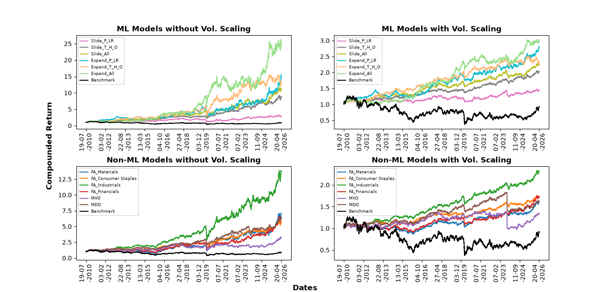

# Table of Contents
1. [Contexto del Proyecto](#contexto-del-proyecto)
    * [Hallazgos Insights, Recomendaciones y sus Enfoques](#hallazgos-insights-recomendaciones-y-sus-enfoques)
2. [Estructura de los Datos y su Verificaciones](#estructura-de-los-datos-y-su-verificaciones)
3. [Resumen Ejecutivo](#resumen-ejecutivo)
    * [Resumen de Descubrimientos ](#resumen-de-descubrimientos)
    * [Tendencia de los Descubrimientos](#tendencia-de-los-descubrimientos)
4. [Detalles de las Hallazgos Insights](#detalles-de-las-hallazgos-insights)
    * [Ratio Sharpe de 0.966 en el Sector Industrial](#ratio-sharpe-de-0966-en-el-sector-industrial)
    * [Impacto del COVID-19](#impacto-de-covid)
    * [Debilidad del Benchmark](#debilidad-del-benchmark)
5. [Modelos, Predicciones y sus Impactos](#modelos-predicciones-y-sus-impactos)
    * [Modelos con Ventanas Deslizantes](#modelos-con-ventanas-deslizantes)
    * [Modelos con Ventanas Expansivas](#modelos-con-ventanas-expansivas)
    * [Resultados](#resultados)
6. [Recomendaciones](#recomendaciones)
    * [La Estrategia Adecuada le Corresponde al Usuario](#la-estrategia-adecuada-le-corresponde-al-usuario)
    * [Enfoque en el Sector Industrial](#enfoque-en-el-sector-industrial)
    * [ML con Mejores Resultados](#ml-con-mejores-resultados)
7. [KPIs](#kpis)
    * [Ratio Sharpe](#ratio-sharpe)
    * [Retorno Compuesto](#retorno-compuesto)
    * [P/L Ratio](#pl-ratio)
8. [Suposiciones y Avisos](#suposiciones-y-avisos)

## Contexto del Proyecto
Capital Andina (CA) es una empresa que gestiona activos en Perú y se especializa en inversiones de renta variable y portafolios en el sector financiero de Sudamérica. Su estrategia de diversificación incluye a empresas financieras que cotizan en mercados dentro de Brasil, Chile, Colombia y Perú. Ellos principalmente se guían por el índice SPLAC, el cual contiene las 40 empresas más grandes en América Latina, y la usan como benchmark. 

CA reconoce los impactos positivos del Machine Learning (ML) y lo quiere integrar en sus estrategias de portafolios. Adicionalmente, ellos presienten que el benchmark actual no es el más adecuado para los movimientos financieros, ya que sus estrategias actuales lo superan consistentemente. CA desea desarrollar un marco de análisis de portafolios basado en datos que permita detallar decisiones informadas en el uso de ML contra estrategias tradicionales. 

Considerando la complejidad de inversiones, las estrategias de portafolio se evaluarán a través de las siguientes métricas financieras: retorno esperado (E(R)), Volatilidad (Std(R)), ratio Sharpe, Downside Deviation (DD), ratio Sortino, Max Drawdown (MD), Porcentaje de retornos positivos (% Pos.(R)) y ratio de ganancias/pérdidas (P/L Ratio). Adicionalmente, se **escalará la volatilidad** para poder eliminar la volatilidad del mercado y enfocarse en las características de cada estrategia. 

 

### Hallazgos Insights, Recomendaciones y sus Enfoques
**Sectores Empresariales**: Una de las estrategias utilizadas por CA se enfoca en asignación fija (de pesos) a través de todo el tiempo. Ellos determinan esta asignación basado en el sector de cada empresa, y algunos candidatos son: energía, financiero, salud, materiales, utilidades, etc. El análisis demuestra que la inversión enfocada en el sector industrial resulta en mejores rendimientos y ratio Sharpe a través de todas las estrategias sin ML.

**ML vs. no-ML**: La diferencia entre estas dos estrategias se nota en métricas específicas. Mientras las estrategias ML son superiores en el **ratio Sharpe y retorno acumulado**, las estrategias no-ML son mejores en la **Volatilidad y Porcentaje de retorno positivo**. La estrategia adecuada depende de las preferencias que el usuario quiere implementar en sus inversiones. 

**Benchmark**: La precognición de CA se convierte en certeza al investigar que todas las estrategias obtuvieron mejores rendimientos que el benchmark. A pesar de eso, el benchmark es una buena referencia al poder capturar turbulencias en el mercado, como la pandemia del COVID. Cuando estos remolinos aparecen en otras estrategias, se pueden comparar con el benchmark para identificar las raíces de estas turbulencias. 

## Estructura de los Datos y su Verificaciones
SPLAC es un índice financiero que consiste en las 40 empresas suramericanas de tamaño y liquidez más alta. Estas compañías varían a través del tiempo, entonces las empresas seleccionadas fueron las que estaban dentro de estas 40 empresas el 31 de agosto de 2026. Reconociendo que no todas estas compañías empezaron al mismo tiempo, se aplicó una filtración para seleccionar a las compañías que estaban activas el 28 de febrero del 2006. Esta fecha se escogió para poder incluir la crisis del 2008 dentro de los datos. 

La información histórica se descargó de YFinance, con los siguientes detalles:
* Fechas (post-filtración): 28/2/2006 - 28/8/2026
* Compañías (post-filtración): AMXB.MX, AXIA3.SA, BBAS3.SA, BIMBOA.MX, BSAC, CEMEXCPO.MX, CENCOSUD.SN, CIB, FEMSAUBD.MX, GCARSOA1.MX, GGB, ISA.CL, PAC, PBR, RENT3.SA, SCCO, SQM, VALE, VIV, WALMEX.MX, WEGE3.SA
* Indicadores: Cierre Ajustado, Cierre, Alto, Bajo, Apertura, y Volumen.

## Resumen Ejecutivo
### Resumen de Descubrimientos
Diferentes sectores de las empresas suramericanas tienen momentos donde son más fuertes o más débiles que los otros sectores. A pesar de esta variación, el **sector industrial** ha obtenido más éxitos y rendimientos que todos los demás, indicando que es un buen sector para hacer inversiones. 

Por otro lado, las estrategias desarrolladas con modelos ML ofrecen una alternativa competitiva a modelos tradicionales. En promedio, los retornos acumulados (al escalar volatilidad) con estrategias de ML obtuvieron **229.17%** de la inversión inicial, mientras que las estrategias sin ML obtuvieron un **172.23%**. Adicionalmente, los ratios de Sharpe también confirman esta diferencia, con las estrategias ML obteniendo un promedio de **0.707**, mientras que las estrategias sin ML obtuvieron **0.566**.

Por el contrario, las estrategias sin ML superan a las estrategias ML en las siguientes categorías: Volatilidad (0.068 vs. 0.075) y Porcentaje de retornos positivos (52.86% vs. 51.83%). Diferentes métricas tienen diferentes niveles de importancia para cada usuario, señalando que la mejor estrategia depende de las preferencias del usuario. 

 

### Tendencia de los Descubrimientos
**Fuerza del Sector Industrial**: Teniendo una inversión fija en las empresas dentro del sector industrial, tiene **1.37 veces**(al escalar volatilidad) y **2.17 veces**(sin escalar volatilidad) mejores rendimientos acumulados que los otros sectores: financiero, materiales y consumo básico. 

**Impacto de COVID**: Todas las estrategias sintieron el impacto económico de la pandemia, la cual ocurrió entre el mes de **marzo de 2020**. A pesar de su influencia negativa, todas las estrategias también empezaron a resaltar y superar la pandemia empezando en **abril 2020**. 

**Referencia del Benchmark**: El benchmark que se utilizó fue el índice SPLAC del sector financiero en Sudamérica. Las comparaciones revelan que **todas** las inversiones directas (en las 40 empresas utilizadas por el SPLAC) resultan en mejores resultados que una inversión directa en el índice. 

## Detalles de las Hallazgos Insights 
### Ratio Sharpe de 0.966 en el Sector Industrial
Dentro de las estrategias de asignación fija, enfocándose en el sector industrial, se pudo construir el portafolio más fuerte entre todas las estrategias sin ML. 

* **Ratio Sharpe**: esta estrategia obtuvo el ratio Sharpe **más alto de 0.966 y 0.929** (sin escalar la volatilidad).
* **Retorno Esperado**: al igual, esta estrategia obtiene los mejores retornos esperados anuales, con 0.184 y 0.055 (sin escalar la volatilidad)

 

### Impacto de COVID
La pandemia del COVID se sintió en todos los aspectos globales, incluyendo al sector financiero.

* **Todas las estrategias**, sea con o sin ML, pueden capturar los impactos drásticos del COVID-19.
* Las estrategias **con volatilidad escalada** fueron **menos afectadas** por estos impactos, al tener una caída más mesurada y con menos pérdidas.
* Todas las estrategias, incluyendo el benchmark, pudieron resaltar sus pérdidas al terminar la pandemia. 

 

### Debilidad del Benchmark
En benchmark, el índice SPLAC obtuvo los mejores resultados dentro del primer año del rango de fechas, pero a través del tiempo fue superado por todos los otros modelos. Considerando que **todos** los otros modelos le superan al índice, se identifica que este benchmark no tiene las mejores estrategias para manejar los movimientos de las 40 mejores empresas de Suramérica. 

## Modelos, Predicciones y sus Impactos
Existen varias formas para crear un modelo que capture las dependencias temporales dentro de un conjunto de datos. En este caso, dos estrategias principales se estudiaron: ventanas deslizantes y ventanas expansivas. Adicionalmente, diferentes combinaciones de las siguientes **métricas financieras**, de cada acción, se investigaron: Precio de Cierre (P), Retornos Logarítmicos (LR), TEMA (T), HLC3 (H) y OBV (O). 

 

### Modelos con Ventanas Deslizantes
En esta estrategia, las ventanas de los datos se deslizaban anualmente, señalando que solo los datos dentro de dos años se utilizaban para entrenar el modelo. Se crearon tres modelos diferentes con esta estrategia. Las arquitecturas eran iguales, pero los datos procesados tenían las siguientes diferencias: datos 1 usaban los indicadores P y RL; datos 2 usaban los indicadores T, H, y O; datos 3 usaban todos los indicadores. 

 

### Modelos con Ventanas Expansivas
En esta estrategia, las ventanas se expandían anualmente para capturar todos los datos desde el comienzo (disponible) hasta el día antes de cuando empiezan los datos de pruebas. Similar a la otra estrategia, se crearon tres diferentes modelos con arquitecturas iguales pero diferentes indicadores en cada conjunto. 

 

### Resultados
Los modelos de las ventanas deslizantes obtuvieron un **promedio ratio Sharpe de 0.695 y 0.645**(al escalar la volatilidad), mientras los modelos de las ventanas expansivas tenían **0.809 y 0.769**(al escalar la volatilidad). En otras palabras, la segunda estrategia predice pesos (de las acciones) que resultan en portafolios con ratios de Sharpe más altos. 

Por el contrario, se registra que en ambas estrategias los modelos que utilizaban todos los indicadores obtuvieron un ratio Sharpe **más que 1.39 (ventanas deslizantes) y 1.19 (ventas expansivas) veces** que todos los demás. Incluso, el modelo con ventana deslizante que utilizaba todos los indicadores obtuvo mejores resultados que los modelos de ventanas expansivas que no utilizaban todos los indicadores. 

Adicionalmente, el **modelo con ventanas expansivas** tiene mejores resultados al **no escalar la volatilidad** (con ratios de 0.905 y 1.254). De lo contrario, el **modelo con ventanas deslizantes** tiene los mejores resultados cuando **sí se escala la volatilidad** (con ratios de 0.844 y 1.252).

## Recomendaciones
### La Estrategia Adecuada le Corresponde al Usuario
Todas las estrategias presentadas se destacan con 10 diferentes métricas, pero ninguna estrategia es la mejor en todas estas métricas. Para desarrollar la mejor estrategia, se recomienda identificar las características y preferencias del usuario.

Las estrategias de **asignación fija tienen los mejores ratios** (con y sin escalar la volatilidad), pero tienen uno de los más MD con -0.436. Un usuario que intenta minimizar los sustos que tiene al enfrentarse con una caída de precios no va a preferir esta estrategia. 

Por otro lado, un usuario puede priorizar el ratio de las ganancias a pérdidas ("P/L Ratio"), teniendo en cuenta que es posible sacrificar un óptimo ratio Sharpe. Existen diferentes combinaciones que se pueden formar al considerar las metas del usuario. 

 

### Enfoque en el Sector Industrial
El sector industrial tiene una gran corrida, obteniendo alrededor de **250% de retorno compuesto** en la inversión inicial. En corto plazo, se recomienda invertir una gran mayoría de los recursos en el sector industrial, siempre y cuando se diversifique con otras acciones. A largo plazo, se recomienda seguir investigando los movimientos del sector, considerando que un cambio del mercado pueda empezar a fortalecer otro sector. 

 

### ML con Mejores Resultados
Se registra que los ML modelos, en ambas estrategias de ventanilla (deslizante y expansiva), obtuvieron mejores rendimientos al utilizar **todos los indicadores**. Se recomienda coleccionar más indicadores para mejorar las predicciones de los modelos.

Adicionalmente, se nota que las **ventanas expansivas obtuvieron mejores resultados que las ventanas deslizantes**. Este patrón ayudaría a capturar cambios históricamente drásticos, señalando al modelo que cambie sus predicciones. En otras palabras, tener más información histórica de las acciones mejora los rendimientos del modelo.

## KPIs
### Ratio Sharpe
(Retornos Esperados)/(Volatilidad de Retornos)

Objetivo: Aumentar el ratio Sharpe del portafolio actual por 67%. Para adquirir estos resultados se utilizarán los 4 mejores modelos para determinar los pesos de las acciones que tengan los mejores rendimientos sin aumentar la volatilidad. 

 

### Retorno Compuesto
\prod_{i=1}^t (1 + retorno_simple_i)

Enfoque: Mejorar el retorno compuesto del portafolio. Esto se modificará por sí mismo al mejorar los rendimientos del portafolio. 

 

### P/L Ratio
(Promedio de Ganancias)/(Promedio de Perdidas)

Enfoque: Esta métrica afecta el bienestar psicológico del usuario, ya que demuestra la cantidad de veces que la estrategia termina con retornos positivos. 

## Suposiciones y Avisos
Este análisis desarrolló las siguientes asunciones:

* El "Cierre Ajustado" del YFinance refleja el valor de las acciones que es utilizado por los inversionistas.
* Los datos del mercado bursátil no tienen estacionariedad y son naturalmente impredecibles. 

